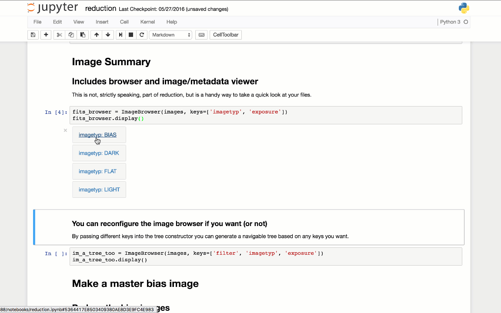
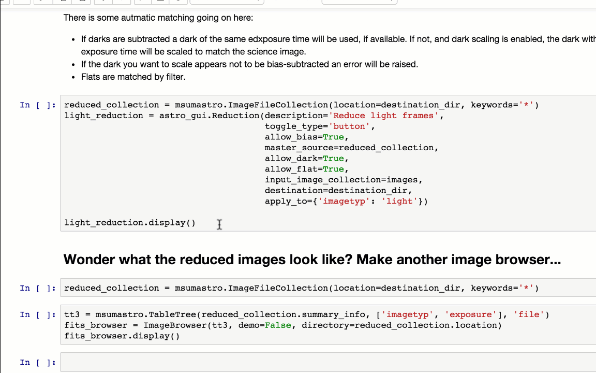

.. _quickstart:

Quickstart
----------

The ``reducer`` package generates a widget-based Jupyter notebook for reducing
astronomical images. The actual reduction steps are done by `ccdproc`_.

Installation
++++++++++++

The recommended way to install ``reducer``, especially on Windows, is with the
`Anaconda python distribution`_. Several of the packages that ``reducer``
depends on need to be compiled...and most people haven't installed a compiler
on Windows.

Installing with anaconda
########################

1. Download and install the `Anaconda python distribution`_.
2. Depending on your platform:

  a. Windows: Open the "Anaconda Command Prompt" from the start menu.
  b. Mac: Open the Terminal app (it is in Applications/Utilities)
  c. Linux: Open a terminal windows.

3. Install ``reducer`` by typing, in the terminal: ``conda install -c mwcraig -c astropy reducer``

Installing with other python distributions
##########################################

Remember, this route requires that you have a compiler installed and properly
configured. On Windows, you do not have that unless you have set it up.

Install ``reducer`` with pip::

    $ pip install reducer

Generate a template notebook
++++++++++++++++++++++++++++

To generate a notebook, navigate to the directory in which you want the
reduced data to end up. Then, at the command line, type::

    $ reducer

That will create notebook called ``reduction.ipynb``. Open that notebook with::

    $ jupyter notebook

Using the notebook
++++++++++++++++++

**The first rule of using the notebook is to read the text cells of the notebook.**

There are three kinds of widgets in the reduction notebook.

Simple image browser
####################

Images are arranged based on the values of keywords in their FITS headers.
Clicking on a file name displays the image and a tab for displaying the
header.

The FITS keywords used to construct the menu tree at the left are determined
by this line in the notebook::

    tt = msumastro.TableTree(images.summary_info,
                             ['imagetyp', 'exposure'],
                             'file')

In this example, images were grouped by ``imagetyp`` and ``exposure``.

Reduction step
##############

Each reduction step (bias subtraction, dark subtraction and flat correction)
has a widget to go along with it. The example shown below is for a processing
a light (science) image.

The key thing to understand here is how ``reducer`` is selecting the
appropriate master (or synthetic) calibration image for each step. To be considered for matching an image file has to have a keyword ``MASTER=True`` and the correct ``IMAGETYP`` for the step (e.g. ``FLAT`` for flat correction). In addition, for dark subtraction, the master dark frame whose exposure most closely matches the image being reduced is selected. For flat frames the ``FILTER`` of the flat must match the ``FILTER`` of the image.

You can select the images to which the reduction step is applied. The widget is created in the notebook with this::

    light_reduction = astro_gui.Reduction(description='Reduce light frames',
                                          toggle_type='button',
                                          allow_bias=True,
                                          master_source=reduced_collection,
                                          allow_dark=True,
                                          allow_flat=True,
                                          input_image_collection=images,
                                          destination=destination_dir,
                                          apply_to={'imagetyp': 'light'})

The ``apply_to`` argument selects the images to which the the reduction step will be applied. To reduce only V-band images of M101 you could (assuming the appropriate keywords are in the FITS header, of course) use::

    apply_to={'imagetyp': 'light', 'filter': 'V', 'object': 'M101'}

Image combination
#################

Calibration images can be combined to make a master (or synthetic) image. An
example of the widget that does that is below, shown for creating master
flats.

.. image:: images/image_combination.gif

Note well that this will create *several* flats. To understand which images in
the source directory will be identified as flats, how they will be grouped,
and what the output files will be called let's look at the notebook code the
created the widget above::

    flat = astro_gui.Combiner(description="Make Master Flat",
                              toggle_type='button',
                              file_name_base='master_flat',
                              group_by='exposure, filter',
                              image_source=reduced_collection,
                              apply_to={'imagetyp': 'flat'},
                              destination=destination_dir)
    flat.display()

The ``apply_to`` argument on line 6 controls which images in the directory of
reduced files will be considered flat frames by this widget. It can be a
dictionary with whatever keywords you want.

The ``group_by`` argument on line 4 sets the names of the FITS keywords that
will be used to group the flat frames. The setting in this example makes sense
for dome flats. For twilight flats you presumably want to group only by
filter. This setting can also be modified in the widget.

The ``file_name_base`` argument on line 3 determines part of the output file
name for the combined flats. One flat is produced for each unique combination
and the file names generated include the values of the keywords used to group
them. For the sample data set that comes with ``reducer``,  these files are
produced::

    master_flat_filter_B_exposure_120.0.fit
    master_flat_filter_I_exposure_5.0.fit
    master_flat_filter_R_exposure_15.0.fit
    master_flat_filter_V_exposure_30.0.fit

It could also be used to combine science images in the unlikely case that you
wanted to simply average the images without aligning them.

.. _Anaconda python distribution: http://continuum.io/downloads
.. _ccdproc: http://ccdproc.readthedocs.org
